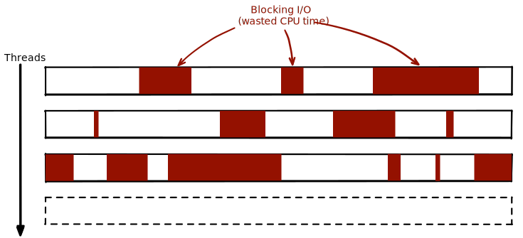

## Riciputi Jacopo
Reactive applications on the JVM
vertx.io


---

# What
Async programming on the JVM made easy.

# How
**Events**, events everywhere. Let Vert.x bring you in the **loop**

# Why
Threads are complex. Orchestrate them even more. 
But your service need to handle a lot events so you need them. 
***What if adding threads is not enough?*** 


---

# Blocking vs non-Blocking

### Performance's enemies: context-switching, I/O operations



---

# Nodejs: a story of successes

* [Libuv](https://libuv.org/)
* [Event loop](https://nodejs.org/en/docs/guides/event-loop-timers-and-nexttick/)
* [Callback pattern](https://nodejs.org/en/knowledge/getting-started/control-flow/what-are-callbacks/)


```javascript
const fs = require('fs');
fs.readFile('/file.md', (err, data) => {
  if (err) throw err;
  console.log(data);
});
moreWork(); // will run before console.log
```

---

# Nodejs: Event-Loop analysis

```
   ┌───────────────────────────┐
┌─>│           timers          │
│  └─────────────┬─────────────┘
│  ┌─────────────┴─────────────┐
│  │     pending callbacks     │
│  └─────────────┬─────────────┘
│  ┌─────────────┴─────────────┐
│  │       idle, prepare       │
│  └─────────────┬─────────────┘      ┌───────────────┐
│  ┌─────────────┴─────────────┐      │   incoming:   │
│  │           poll            │<─────┤  connections, │
│  └─────────────┬─────────────┘      │   data, etc.  │
│  ┌─────────────┴─────────────┐      └───────────────┘
│  │           check           │
│  └─────────────┬─────────────┘
│  ┌─────────────┴─────────────┐
└──┤      close callbacks      │
   └───────────────────────────┘
```


---


# Vert.x

* Don't call us, we'll call you
   * a timer has fired
   * data IN from socket 
   * etc..
* Multi-Reactor Pattern, not just one thread
* Never block the event loop
* ***Futures*** are the future!


---

# Vert.x - Multi-Reactor Pattern

### Reactor pattern = 1 thread

By default Vert.x creates 2 * N_CORES event-loops. 

### How atomicity is guaranteed?

* Handler will never be executed concurrently;
* In most cases will always be called using the exact same event loop.

---

# Golden Rule - Don't block the event loop

Vert.x API are non-blocking, but handlers...

* Thread sleep;
* Waiting for a lock;
* Database query;
* Network call;
* Complex calculation;
* etc.. 

These operations will prevent other handlers to be consider for a *significant  amount of time*

Vert.x will help you in identify these cases through logs like: 

> Thread vertx-eventloop-thread-3 has been blocked for 20458 ms

---

# Futures

* Force developer to handle failure results
* Dev can compose them
* Dev can coordinate them

```java
   future
      .compose(Future::succeededFuture)
      .compose(e -> {
         return Future.failedFuture("Props corrupted");
      })
      .transform(f -> {
         assertFalse(f.succeeded());
         return Future.failedFuture(f.cause());
      })
      .recover(t -> {
         return Future.succeededFuture(fs.propsBlocking("./"));
      })
      .onComplete(e -> {
         assertTrue(e.succeeded());
      });
```

---

# Verticles

Code (in different languages) deployed, handled and run by Vert.x that can communicate with other piece of code

## Standard
Runs on event loop. **All the internal handler will be run on the same event loop!**
Developer can write code for a single threader application. 
Vert.x will handle threading and scaling. 

Please do not create here your own thread! Or.. if so.. **take your responsability!!!**

## Worker

Useful in order to run blocking code out of the event loops. 
Vert.x provide a pool of worker but we can deploy our own verticles as worker.


---

# Verticles - interface

```java
public class MyVerticle extends AbstractVerticle {

 // Called when verticle is deployed
 public void start() {
 }

 // Optional - called when verticle is undeployed
 public void stop() {
 }

}

... 

public static void  main(String[] args) {
   vertx.deployVerticle("com.mycompany.MyOrderProcessorVerticle");

   // Deploy a JavaScript verticle
   vertx.deployVerticle("verticles/myverticle.js");

   // Deploy a Ruby verticle verticle
   vertx.deployVerticle("verticles/my_verticle.rb");

   DeploymentOptions options = new DeploymentOptions().setInstances(16);
   vertx.deployVerticle("com.mycompany.MyOrderProcessorVerticle", options);

   
   DeploymentOptions optionsWorker = new DeploymentOptions().setWorker(true);
   vertx.deployVerticle("com.mycompany.HeavyWorker", optionsWorker);
}
```

---

# Event bus

> "Nervous system of Vert.x"

It is delivering messages to Verticles, even remote verticles (cluster), event client-side JS if it's bridged.

* **Address**: Messages are sent on the event bus to an address.
* **Handler**: Messages are received by handlers. You register a handler at an address.
* **Pub/Sub**: The event bus supports publishing messages.
* **Point-to-Point**: Messages are sent to an address. Vert.x will then route them to just one of the handlers registered at that address.
* **Request-Response**: With point-to-point messaging, an optional reply handler can be specified when sending the message.


---

# If you close one eye.. you can see Actors!

* Concurrency is handled by library
* Verticles are scalable
* Though event bus Verticles can exchange messages
* Verticle has an internal state that is accessible through event bus messages exchange 